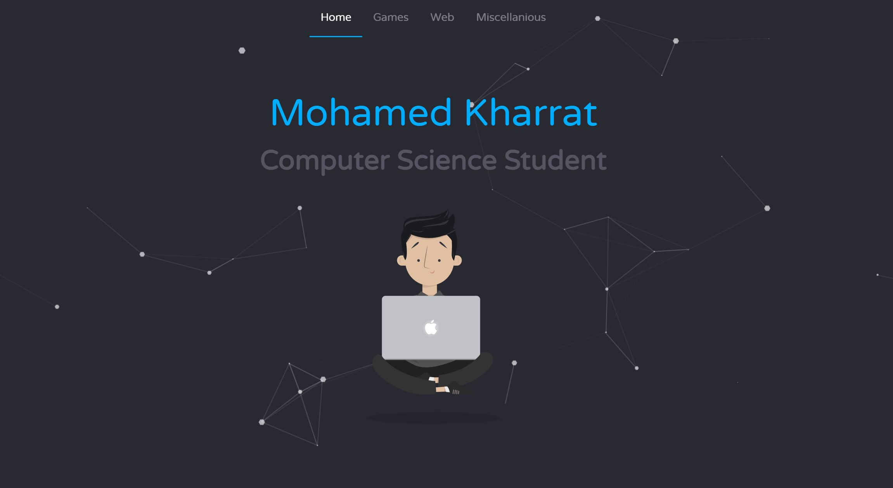

# DevPortfolio

DevPortfolio is my personal portfolio website designed to showcase my projects, skills, and professional experience. The site is built with PHP, JavaScript, HTML, and CSS.
The Website is not yet finished, I am planning on hosting it on Heroku or a similar platform as soon as it is ready for showcase.

## Highlights
- Project showcases with detailed descriptions and links
- About Me section highlighting my background and skills
- Contact information for potential clients or employers
- Responsive design for optimal viewing on any device

## Screenshot

## Local Development
To run the site locally with WAMP:
1. Clone the repository: `git clone https://github.com/imruki/DevPortfolio.git`
2. Navigate to the project directory: `cd DevPortfolio`
3. Start WAMP and ensure it's running.
4. Move the project files to the `www` directory of your WAMP installation.
5. Open your web browser and go to `http://localhost/DevPortfolio` to view the site.

## License
This project is open source under the MIT License. See the [LICENSE](https://github.com/imruki/DevPortfolio/blob/main/LICENSE) file for more information.
